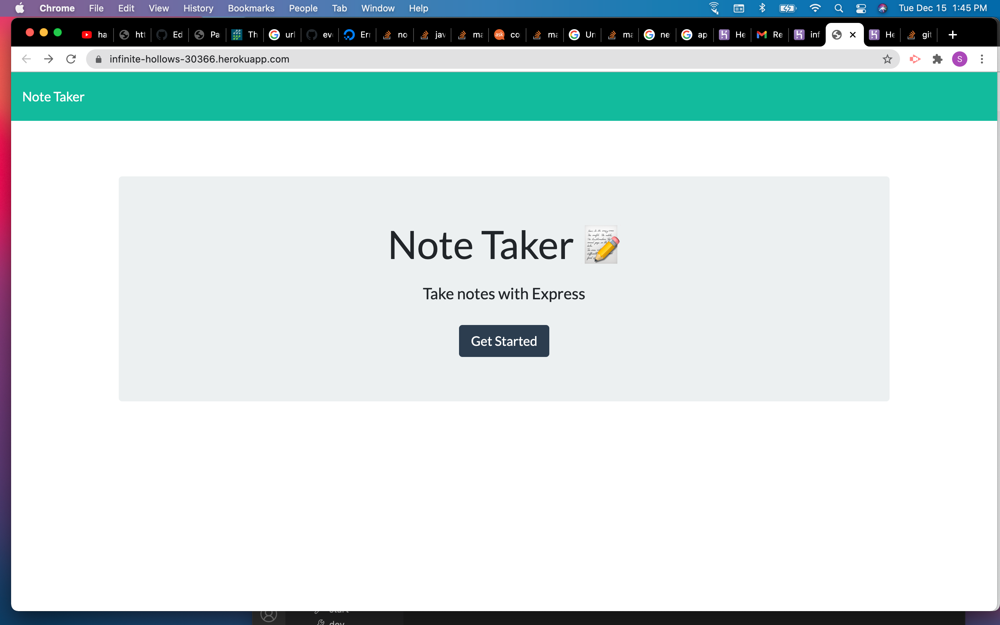
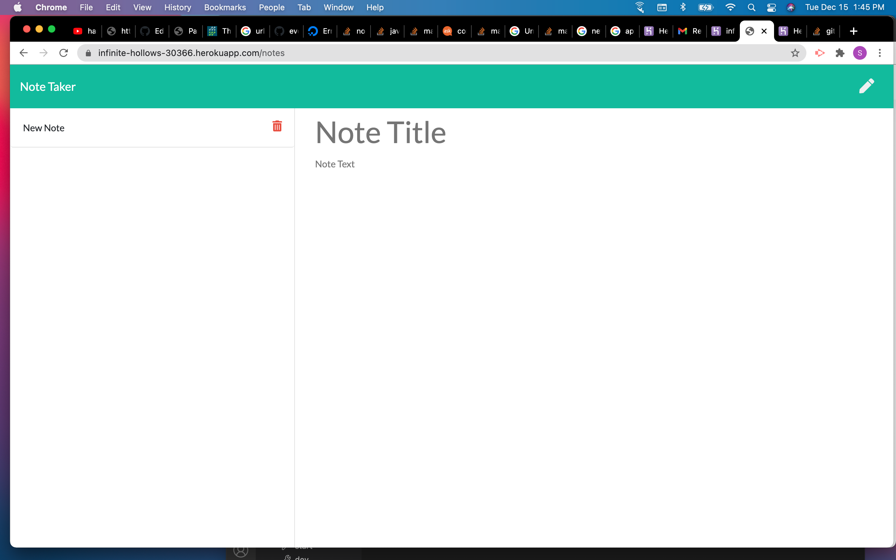

# MSU_HW11
Michigan State Bootcamp Homework #11 

## Description
This application can be used to write, save, and delete notes. This application use an express backend to save and retrieve note data from a JSON file.

User Story
AS A user, I want to be able to write and save notes

I WANT to be able to delete notes I've written before

SO THAT I can organize my thoughts and keep track of tasks I need to complete

## SCREENSHOTS

   

## Repository
- [Heroku App](https://infinite-hollows-30366.herokuapp.com/)
- [Project Repo](https://github.com/ShaneD42/MSU_HW11)

